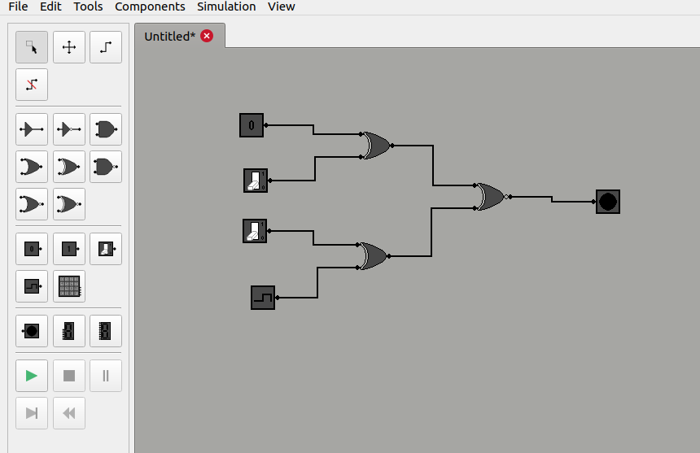

# LogicSim

**LogicSim** is a logic design simulator, written in C++ and Qt. LogicSim allows the simulation of digital circuits combining digital components, such as logic gates.

LogicSim is free and open-source.

## User interface

LogicSim's user interface has been created using Qt and C++. The interface consists of a main area, the design area, where circuits can be put together. To the left, a toolbar is available, which provides quick access to the available tools.

  

As seen on the image above, all options can be accessed via the menu at the top. Below, each category and its functions is explained.

### File

LogicSim uses its own file type to save created circuits. Such files use the *.lsc* extension. Once a circuit has been created, it can be saved using the *Save (CTRL+S)* option. Saved files can then be reopened using the *Open (CTRL+O)* option.

LogicSim allows simultaneously opening multiple files. At the top of the design area, each file has its own tab. A new, empty tab can be created using the *New (CTRL+N)* option. An open tab can be closed using the *Close (CTRL+W)* option, or by clicking on the *X* icon next to the file name.

### Edit

The expected edit functions are available in LogicSim. Using the *Undo (CTRL+Z)* option, the last performed action can be undone. This includes basically any action that would edit the underlying file, meaning adding components or wires, deleting them, moving them, or changing component/simulation properties. Using the *Redo (CTRL+Y or CTRL+SHIFT+Z)* option, the last undone action can be redone.

LogicSim also allows for cutting, copying, pasting and deleting selected components, using the *Cut (CTRL+X)*, *Copy (CTRL+C)*, *Paste (CTRL+V)* and *Delete (DEL)* options. Note that if multiple connected components have been selected and copied, once pasted, components will only connect to other components in the same selection, but not components that weren't in the selection.

### Tools

LogicSim provides the following basic tools for interacting with a circuit.

With the *Select* option, components can be added to a selection. The selection tool works similarly to selections in most desktop environments:
* Clicking on a component will clear the existing selection and add the new component to it.
* Clicking on empty space will clear the existing selection.
* Clicking and dragging will create a rectangular area. On release, anything inside the area will be selected.
* Clicking on a component while holding CTRL will add or remove it from the existing selection, without otherwise affecting the selection.

A few components have properties. For instance, the *Oscillator* input component's low ticks, high ticks and phase can be changed. Double clicking such components while in select mode will bring up a properties popup, where these properties can be changed.

With the *Move* option, the view of the design area can be moved. Note that this will not move the components themselves, only the design view. Existing components will stay in the same positions.

With the *Wire* option, the wire tool can be enabled. In this mode, it is possible to draw wires between components. Pressing on a component will create a wire, starting at the nearest input or output. The wire can then be dragged to the desired component's output or input. While dragging, when approaching an input or output, the wire will snap to it. Once the wire has snapped, releasing will attempt to create the connection. Note that any inputs can only be driven once, while each output can drive many inputs.

With the *Wire Remove* option, the wire remove tool can be enabled. In this mode, it is possible to delete created wires. Approaching a wire with the cursor will mark the wire, indicating that it has been marked for deletion. Clicking will result in the deletion of the wire.

### Components

Under the *Component* menu, all the available circuit components can be selected for insertion. Gates, inputs and outputs are also available on the toolbar to the left, but this menu also contains other components, such as latches or flip flops.

Once a component has been selected, clicking on the design area will insert a copy of that component at that spot.

### Simulation

Simulating a circuit is done using ticks. Each tick consists of a single evaluation of the circuit. A simulation runs at the predetermined frequency, corresponding to the number of ticks that are simulated per second. This frequency can be changed via the *Properties* option of the Simulation menu. Any value between 1-1000 Hz can be used as a frequency.

To simulate a circuit, it must first be valid. This means that the inputs of all components must be driven. Outputs, on the other hand, don't necessarily have to drive an input.

Once a circuit is valid, the *Start* option of the Simulation menu can be used. This will start simulating the circuit at the given frequency.

Using the *Pause* option will pause the simulation. While paused, the simulation can be progressed by a single tick using the *Step* option. The *Continue* option will continue the simulation. Finally, the *Reset* option can be used to reset the simulation to its initial state.

Components that need to evaluate their inputs to create outputs have a predetermined delay (in ticks). For instance, logic gates have a delay of 1 tick, while memory components have a delay of 5. Input and output components do not have a delay.

For this reason, running a simulation at a very low frequency might produce unexpected results. This is essentially because such a low frequency is equivalent to the components being really slow to evaluate their inputs. An example of this can be observed when running the counter circuit at *saves/counter.lsc*. Running the circuit at a high frequency results in the output 7 segment display smoothly switching between the correct digits, while running it at a low frequency (and appropriately adjusting the oscillator's ticks) results in unexpected digits.

### View

The view menu contains some additional options for viewing and simulating the circuit. Toggling the *Toolbar* option allows hiding the toolbar on the left. The *Wire Color* option changes the wires during simulation to a different color, if their driving component is currently outputting an 1.

Finally, the *Zoom In (CTRL + scroll forward)* and *Zoom Out (CTRL + scroll backward)* options allow for zooming in and out, while *Reset Zoom* resets the zoom level to the default.

Note that when zooming using the shortcuts, the zoom is performed around the cursor. Using the options from the menu instead zooms around the center of the design area.

## Model

The part of the code calculating the outputs of a circuit is referred to as the model. LogicSim is designed in such a way that the model is separate from the user interface, and does not depend upon it in any way. As such, the model can be separated from the user interface and can be used as an API.

The definitions for the model can be found under *include/model*, while the implementations under *src/model*.

Currently, some functionality is lacking, such as retrieving specific components from a circuit, as well as correctly handling pointers to created components.

## Future plans

LogicSim is still in development, and thus is expected to contain bugs. Additionally, there are various features that will be added in the future. Some of them are listed below:

* More complex components, such as decoders and multiplexers.
* Nodes that wires can connect to.
* Option for random initial values for memory components (currently always 0).
* Option for unknown outputs, allowing for simulation of invalid circuits.
* (Possibly) a grid for components to snap to.

## Credit

This project was developed by [notTypecast](https://www.github.com/notTypecast), and was inspired by [MMLogic](https://www.softronix.com/logic.html).